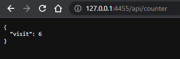

# Flask API Visit Counter

A lightweight Flask API application that tracks the number of visits to your endpoints. Perfect for integrating simple visit counters into your web projects or applications.

IMAGE
    


## Features

- Tracks visits to specific endpoints
- Lightweight and easy to deploy
- Supports JSON responses for seamless API integration
- Scalable design for expanding features

---

## Installation

### Prerequisites

Ensure you have the following installed on your machine:
- Python 3.7+
- pip (Python package installer)
- Flask

### Steps

1. Clone the repository:
   ```bash
   git clone https://github.com/Levi-Michael/Flask-API-VisitCounter.git
   cd Flask-API-VisitCounter
   ```

2. Create a virtual environment (optional but recommended):
   ```bash
   python -m venv venv
   source venv/bin/activate   # On Windows, use `venv\Scripts\activate`
   ```

3. Install dependencies:
   ```bash
   pip install -r requirements.txt
   ```

4. Run the application:
   ```bash
   python app.py
   ```

5. Access the API locally:
   ```
   http://127.0.0.1:5000
   ```

---

## Usage

### Example Endpoints

1. **Root Endpoint**
   - **Description:** Displays the current visit count.
   - **Method:** `GET`
   - **URL:** `/`
   - **Response:**
     ```json
     {
       "message": "Welcome to the Visit Counter API!",
       "visits": 10
     }
     ```

2. **Custom Counter Endpoint**
   - **Description:** Tracks visits to a specific resource or page.
   - **Method:** `GET`
   - **URL:** `/counter/<resource>`
   - **Response:**
     ```json
     {
       "resource": "homepage",
       "visits": 5
     }
     ```

---

## API Documentation

### Endpoints

| Endpoint           | Method | Description                 | Parameters  |
|--------------------|--------|-----------------------------|-------------|
| `/`                | `GET`  | Displays total visits       | None        |
| `/counter/<name>`  | `GET`  | Tracks visits to `<name>`   | `<name>`    |

### Example Request

```bash
curl http://127.0.0.1:5000/counter/homepage
```

### Example Response

```json
{
  "resource": "homepage",
  "visits": 25
}
```

---

## Contributing

Contributions are welcome! To contribute:

1. Fork the repository
2. Create a feature branch: `git checkout -b feature-name`
3. Commit your changes: `git commit -m 'Add new feature'`
4. Push to the branch: `git push origin feature-name`
5. Open a Pull Request

---

## Contact

Feel free to reach out for questions or collaboration opportunities or suggestions, open an issue or contact me directly through my [GitHub profile](https://github.com/Levi-Michael).

